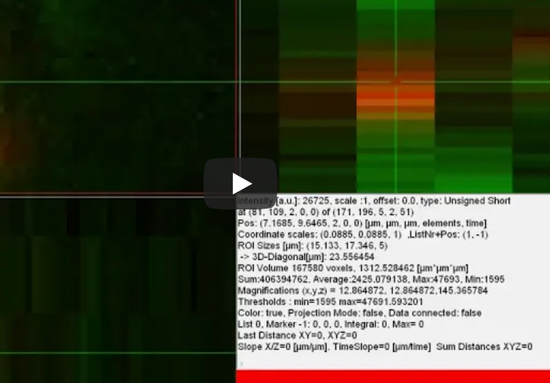

## View5D.jl  - interface to View5D, an interactive data viewer 

[View5D.jl](https://github.com/RainerHeintzmann/View5D.jl) is a Java-based viewer for up to 5-dimensional data (including complex images). It supports three mutually linked orthogonal slicing displays for XYZ coordinates, arbitrary numbers of colors (4th dimension) which can also be used to display spectral curves and a time slider for the 5th dimension.  

[](https://codecov.io/gh/RainerHeintzmann/View5D.jl)
[](https://github.com/RainerHeintzmann/View5D.jl/actions/workflows/ci.yml)

For information on using the [Java-based View5D](https://github.com/bionanoimaging/View5D) see the [Documentation](https://nanoimaging.de/View5D/) with Tutorials, a [Command Reference](https://nanoimaging.de/View5D/View5DCommandReference.html) and a [Cheat-Sheet](https://nanoimaging.de/View5D/CheatSheet.pdf).

# Installation
You can install the latest release via:
```julia
julia> ] add View5D.jl
```
or for the developer version:
```julia
julia> ] add https://github.com/RainerHeintzmann/View5D.jl
```
`View5D.jl` uses `JavaCall.jl` which needs a working java installation on your system. If you do not already have one,
you should install `OpenJDK` and you may have to set the `JAVA_HOME` variable to the installation directory on Windows.

# Quick Overview

Here is an image of how the viewer displays multidimensional data using connected orthogonal views.
Note the various statistical information included real-space units (µm) displayed in the lower right information panel.
And the bottom right panel displaying the various colormaps of this 4-channel image (data curtasy Kai Schink et al.).


## Quick Examples
```julia
  julia> using View5D
  
  julia> view5d(rand(6,5,4,3,2)) # a viewer with 5D data should popp up
  
  julia> using TestImages
  
  julia> img1 = transpose(Float32.(testimage("resolution_test_512.tif")));
  
  julia> img2 = testimage("mandrill");
  
  julia> img3 = testimage("simple_3d_ball.tif"); # A 3D dataset
  
  julia> v1 = view5d(img1);
  
  julia> v2 = view5d(img2);
  
  julia> v3 = view5d(img3);
```

## Supported Datatypes
The interaction to julia is currently at a basic level of invoking the viewer using existing data. However, it already supports a wide range of data formats: `Float32`, `Float64`, `UInt8`, `Int8`, `UInt16`, `Int16`, `UInt32`, `Int32`, `Int`.
`Complex32`, `RGB` and `Gray`

## Tracking over Time
`View5D` also supports displaying and interacting with tracking in 3D over time (and other combinations) datasets.  This can come in handy for single particle or cell tracking. A particularly interesting feature is that the data can be pinned (aligned) to a chosen track. 

## Menus

`View5D` has 3 context menus (main panel, element view panel and general) with large range of ways to change the display. A system of equidistant location (and brightness) information (scaling and offset) is also present but not yet integrated into julia. 

## Complex Data
Display of `Complex`-valued data can be toggled between `magnitude`, `phase`, `real` and `imaginary` part.  A complex-valued array by default switches the viewer to a `gamma` of 0.3 easing the inspection of Fourier-transformed data. However, gamma is adjustable interactively as well as when invoking the viewer.

# Background
See this YouTube Video for more details:
[](https://www.youtube.com/watch?v=fqa82MmJlAA&list=PL3LueK3ij6Wm2VjaaibNdulxFvA6VhVRv)


The Java viewer [View5D](https://nanoimaging.de/View5D) has been integrated into Julia with the help of [JavaCall.jl](https://github.com/JuliaInterop/JavaCall.jl).  Currently the viewer has its full Java functionality which includes displaying and interacting with 5D data. Generating up to three-dimensional histograms and interacting with them to select regions of interest in the 3D histogram but shown as a selection in the data. It allows selection of a gate `element` where thresholds can be applied to which have an effect on statistical evaluation (mean, max, min) in other `element`s if the `gate` is activated.
It further supports multiplicative overlay of colors. This feature is useful when processed data (e.g. local orientation information or polarization direction or ratios) needs to be presented along with brightness data. By choosing a gray-valued and a  constant brightness value-only (HSV) colormap for brightness and orientation data respectively, in multiplicative overlay mode a result is obtained that looks like the orientation information is staining the brightness. These results look often much nicer compared to gating-based display based on a brightness-gate, which is also supported.
Color display of floating-point or 16 or higher bit data supports adaptively updating colormaps.
Zooming in on a colormap,  by changing the lower and upper display threshold, for some time the colormap is simply changed to yield a smooth experience but occasionally the cached display data is recomputed to avoid loosing fine granularity on the color levels.


## Interaction with Julia
The interaction to Julia supports calling the viewer via one main method `view5d` supporting various options. Since the viewer is most useful for quick visualization and debugging, a multitude of short-hand convenience functions are provided:
- `vv(data)`: starts a new viewer (window) and displays the data
- `vp(data)`: starts a new viewer (window) and displays the data as complex values with a **color-phase** (multiplicative) overlay as a second channel. This is particularly useful for displaying complex-valued data. By default the `gamma ` correction for display is set to 0.3 enhancing the low-values. Naturally this can be prevented by the optional named argument `gamma` for all of the calls.
- `ve(data)`: concatenates the data to display to the currently "active" viewer as a new entry along the element (==color) direction.
- `vt(data)`: concatenates the data to display to the currently "active" viewer as a new entry along the time (slider on the right side) direction.
- `vtp(data)`, `vep(data)`: concatenates color-phase display (see `vp`) along respective data directions.
- `vr(data)`: replaces the currently displayed data in the currently "active" viewer by this new `data`.
- `vrp(data)`: replaces color-phase display data in the currently "active" viewer by this new color-phase display `data`.

All of these function have corresponding macros (`@vv`, `@vp` etc.) to be used in analogy to the `@show` method. This eases debugging. If the preceding expression is a viewer reference, display is directed to this specific viewer. Here an example to update a specific viewer display every second in a for loop:
```julia
v= @vr rand(10,10,10,3); for n in 1:10  sleep(1); @vr v rand(10,10,10,3) end
```
Importing and exporting hierarchical sets of markers into and from the viewer are supported (`export_marker_lists`, `import_marker_lists`).

View5D features a wide range of data formats: `Float32`, `Float64`, `UInt8`, `Int8`, `UInt16`, `Int16`, `UInt32`, `Int32`, `Int`, `Complex32`, `RGB` and `Gray`, also the outputs of the `Images.jl` `BioformatsLoader.jl` package. If context information such as axes sizes is available, it will shown accordingly in the viewer.

Display of `Complex`-valued data can be toggled between `magnitude`, `phase`, `real` and `imaginary` part.  A complex-valued array by default switches the viewer to a `gamma` of 0.3 easing the inspection of Fourier-transformed data. However, gamma is adjustable interactively as well as when invoking the viewer.

Since the viewer is written in Java and launched via JavaCall its thread should be pretty independent from julia. This should make the user experience pretty smooth also with minimal implications to julia threading performance. 


# List of some useful commands to interact with View5D from julia
* `view5d()`: visualizes data. Via "mode" it can be selected whether a new viewer will be used (`mode="new"`) or the data is appended to the existing viewer via the element (`mode="add_time"`) or time direction (`mode="add_time"`). Data can also be replacing currently displayed data (`mode="replace"`), which is useful to display iterative updates.
* `process_keys()`: the easiest way to remote-control the viewer by sending it key-strokes. Be careful: almost all keys have a meaning assigned and the viewer has no undo function.
* `set_display_size()`: sets the size (in pixels) this viewer occupies on the screen.
* `set_title()`: sets a new title to the viewer window.
* `to_front()`: brings the viewer to the front
* `set_gamma()`: sets the gamma display-value for a particular color channel (element)
* `set_min_max_thresh()`: sets the minimum and maximum display value for a particular color channel (element).
* `export_marker_lists()`, `import_marker_lists()`: these functions allow you to display location information such as obtained from tracking algorithms.


# Known issues
* Current problems of `View5D` are that it is not well suited to displaying huge datasets. This is due to memory usage and the display slowing down due to on-the-fly calculations of features such as averages and the like. 
